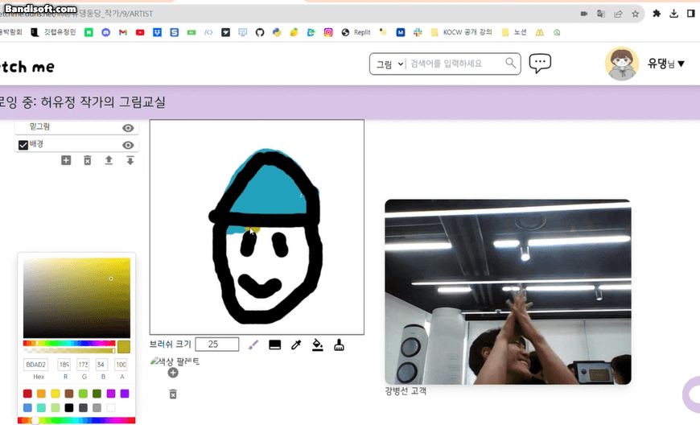

# 화상 캐리커처 플랫폼 Sketch Me

# 개발문서

[Notion](https://www.notion.so/0f2e0b26976d46ad97065bbc6050cd99?pvs=21)

# Tech Stack

- Spring Boot Framework 3.1.2
- Java 17
- Spring Batch
- JPA, JPQL, QueryDSL
- Docker
- Docker Compose
- Shell Script
- Kafka

# Concept

작가가 고객의 얼굴을 보고 화상으로 캐리커처를 그리는 플랫폼

# 주요 도메인

- 인증 / 인가
- 갤러리 검색 / 조회
- 예약
- 채팅
- 챗봇
- 화상 회의

# 주요 기능

- 갤러리 검색, 작가 검색 기능
- 작가에게 예약 걸기 기능
- 예약 수락, 거절 기능
- 사용자 간 채팅 기능
- 챗봇이 예약 알람과, 예약 시간 임박 알람을 보내는 기능
- 화상 회의실 기능
- 회의실 안에서 멀티 레이어로 실시간으로 그림을 그릴 수 있는 기능
- 그림을 그리는 과정을 타임랩스 GIF로 만들어 다운로드할 수 있고, Public하게 공개할 수 있는 기능

# 기술 스택 세부 사항

| 기능             | 활용한 기술 스택                     |
| ---------------- | ------------------------------------ |
| 화상 회의실 기능 | OpenVidu                             |
| 챗봇             | Spring Batch                         |
| 채팅             | Web Socket, Kafka                    |
| CICD             | Jenkins                              |
| Infra            | Docker, Docker Compose, Shell script |

# 시연

# 화면

[Click](화면.md)

# 아키텍처

# 역할

| 이름   | 개발 분야  | 담당 파트                                      | 기타 역할       |
| ------ | ---------- | ---------------------------------------------- | --------------- |
| 김소희 | 프론트엔드 | OpenVidu 화상 회의                             | 팀장            |
| 김영석 | 프론트엔드 | 전체적인 UI, UX 담당                           | 프론트엔드 리더 |
| 박지원 | 프론트엔드 | 채팅 (웹소켓 통신)                             |                 |
| 강병선 | 백엔드     | 채팅 (Kafka, 웹소켓 통신), 예약                | 백엔드          |
| 조성찬 | 백엔드     | OpenVidu API 서버 개발 및 CICD 파이프라인 구축 | 인프라, CICD    |
| 허유정 | 백엔드     | 유저 인증 / 인가 및 전체적인 API 개발          |                 |

# 앞으로의 계획

| 할 일                                           | 실행 일자   | 담당 인원      |
| ----------------------------------------------- | ----------- | -------------- |
| Port And Adapter (헥사고날 아키텍처)로 리팩토링 | 9/28 ~ 10/4 | 강병선, 조성찬 |
| Domain, Application 계층을 테스트하는 코드 작성 | 10/5 ~ 11/5 | 강병선, 조성찬 |
| Kafka에서 Redis로 Message Broker 전환           | 11월 중     | 강병선         |

# Wiki

## 강병선
- [JPA 연관관계 정리](https://www.notion.so/seongchancho/JPA-1babd04c9f9142f4b7f2fb8f2ce28e16?pvs=4)
- [Spring WebSocket](https://www.notion.so/seongchancho/Spring-WebSocket-a18deb9b2777436a943a3369889b2fdb?pvs=4)
- [Spring STOMP](https://www.notion.so/seongchancho/Spring-STOMP-9f5dc34119c640328809294da25da6ed?pvs=4)
- [Kafka](https://www.notion.so/seongchancho/kafka-5620310c37de4b279266330498d30912?pvs=4)
- [Spring Batch](https://www.notion.so/seongchancho/Spring-Batch-e3105796a8d3484ba35ba264be15336a?pvs=4)